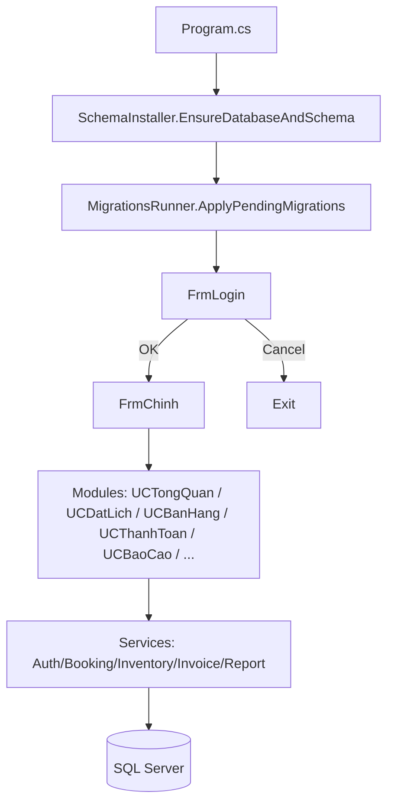

<div align="center">
  
  <h1>🎾 DemoPick</h1>
  <p><i>Nền tảng quản lý sân Pickleball chuyên nghiệp, vận hành khép kín và tự động hóa</i></p>
  
  [](#)
  [](#)
  [](#)
  [](#)
</div>

---

**DemoPick** là nền tảng quản lý sân Pickleball chuyên nghiệp được xây dựng trên .NET Framework 4.8 (WinForms). Ứng dụng tối ưu hóa những quy trình vận hành cốt lõi nhất: từ **đặt lịch, quản lý bán hàng (POS)**, đến **quy trình thanh toán** và **phân tích báo cáo**, mang lại trải nghiệm quản trị mượt mà, chính xác và hiệu suất cao. Đặc biệt, hệ thống tích hợp sẵn cơ chế **tự khởi tạo Cơ sở dữ liệu và xử lý Migrations** tự động vô cùng linh hoạt.

---

## 📑 Nội dung

- [DemoPick là gì?](#demopick-là-gì)
- [Tính năng chính](#tính-năng-chính)
- [Kiến trúc nhanh](#kiến-trúc-nhanh)
- [Chạy nhanh (Dev)](#chạy-nhanh-dev)
- [Database workflow (script-first)](#database-workflow-script-first)
- [Cấu trúc thư mục](#cấu-trúc-thư-mục)
- [Tài liệu trong repo](#tài-liệu-trong-repo)
- [Smoke test](#smoke-test)
- [Ghi chú bảo mật](#ghi-chú-bảo-mật)

---

## 🌟 DemoPick là gì?

DemoPick được thiết kế chuyên biệt để giải quyết trọn vẹn bài toán vận hành tại các tổ hợp sân Pickleball hiện đại. Dự án tập trung mang tới giá trị thực tiễn qua các nhóm nghiệp vụ then chốt:

- 📅 **Hệ thống đặt lịch thông minh:** Hiển thị trực quan lịch trống/đã đặt theo từng sân và khung giờ. Cơ sở dữ liệu giám sát chặt chẽ, loại bỏ hoàn toàn rủi ro trùng lịch (conflict booking).
- 🛠️ **Quản lý cố định & Bảo trì:** Cho phép khóa lịch (block) với các lịch chơi cố định của hội nhóm hoặc lịch bảo trì sân bãi. Trạng thái bảo trì được bóc tách hoàn toàn nhằm đảm bảo tính chính xác cho báo cáo doanh thu và tỷ lệ lấp đầy.
- 🛒 **Trạm bán hàng (POS):** Thao tác linh hoạt, giúp nhân viên dễ dàng order các sản phẩm/dịch vụ (như nước uống, thuê bóng...) gắn trực tiếp vào ca sân hiện tại của khách.
- 💳 **Thanh toán hợp nhất:** Ghép nối tiền giờ thuê sân và danh sách dịch vụ bán lẻ vào chung một hóa đơn, đồng thời tự động kích hoạt tiến trình giảm trừ tồn kho mượt mà.
- 📊 **Báo cáo & Dashboard:** Phân tích trực quan thông qua biểu đồ và số liệu cung cấp thông tin về KPI vận hành, công suất khai thác, xếp hạng top sân và xu hướng tăng trưởng.

---

## Tính năng chính

| Nhóm | Mô tả | UI/Thành phần tiêu biểu |
|---|---|---|
| Xác thực | Đăng nhập, đăng ký, đổi mật khẩu | `FrmLogin`, `FrmRegister`, `FrmDoiMatKhau`, `AuthService` |
| Đặt lịch | Tạo booking, hiển thị lịch theo ngày | `UCDatLich`, `FrmDatSan`, `BookingController` |
| Cố định/Bảo trì | Tạo block lặp (recurring), dùng cho cố định hoặc bảo trì | `FrmDatSanCoDinh` |
| POS/Bán hàng | Chọn sản phẩm, giảm giá, tạo giỏ | `UCBanHang`, `PosService`, `InventoryService` |
| Thanh toán | Checkout tiền sân + sản phẩm, sinh invoice | `UCThanhToan`, `InvoiceService` |
| Báo cáo | Lọc theo thời gian, xem KPI/Top | `UCBaoCao`, `ReportService`, `Reports/Bill.rdlc` |

---

## Kiến trúc nhanh



**Điểm nhấn**
- Database được dựng theo kiểu **script-first**: schema + seed + migrations nằm trong thư mục `Database/`.
- App khởi động sẽ cố gắng đảm bảo DB tồn tại, chạy schema, rồi apply migrations trước khi vào UI.

---

## Chạy nhanh (Dev)

### 1) Yêu cầu môi trường

- Windows
- Visual Studio (hoặc MSBuild) hỗ trợ .NET Framework
- .NET Framework 4.8
- SQL Server / SQL Server Express

### 2) Cấu hình kết nối DB

Sửa connection string `DefaultConnection` trong [App.config](App.config).

Ngoài ra có thể override bằng env var `DEMOPICK_CONNECTION_STRING` (ưu tiên hơn App.config) để tránh hardcode/commit connection string.

Ví dụ (SQL Express + Windows Auth):
```xml
<add name="DefaultConnection" connectionString="Server=.\SQLEXPRESS;Database=PickleProDB;Integrated Security=True;" providerName="System.Data.SqlClient" />
```

**Best-effort bảo vệ connectionStrings (opt-in)**
- Set `DEMOPICK_PROTECT_CONNECTIONSTRINGS=1` (hoặc appSetting `ProtectConnectionStrings=true`) để app thử encrypt section `connectionStrings` trong file `.exe.config` khi chạy.

### 3) Restore packages & Build

Repo dùng `packages.config` và restore theo cấu hình ở [NuGet.Config](NuGet.Config) (mặc định restore ra thư mục `..\packages`).

Gợi ý:
- Nếu bạn dùng VS Code, có thể chạy task build (kèm restore) theo cấu hình `tasks.json` của workspace.
- Nếu build bằng CLI, có thể chạy `nuget restore` rồi build `.sln`.

### 4) Run

Chạy app sẽ tự:
1) Tạo DB (nếu chưa có)
2) Chạy schema script (embedded resource)
3) Apply migrations
4) Mở màn hình đăng nhập

**DEBUG-only bootstrap Admin**
- Ở build DEBUG, app có thể seed 1 tài khoản `admin` nếu bảng `StaffAccounts` đang rỗng.
- Mật khẩu bootstrap sẽ lấy từ env var `DEMOPICK_BOOTSTRAP_ADMIN_PASSWORD` hoặc tự sinh ngẫu nhiên và hiển thị 1 lần.

---

## Database workflow (script-first)

Tài liệu chi tiết: [Docs/DB-WORKFLOW.md](Docs/DB-WORKFLOW.md)

### Schema script
- File chính: [Database/PickleProDB_Complete.sql](Database/PickleProDB_Complete.sql)
- Được chạy từ embedded resources khi app khởi động (giảm rủi ro bị sửa `.sql` cạnh file chạy).

### Migrations
- Thư mục: [Database/Migrations](Database/Migrations)
- Quy ước tên: `NNNN__Description.sql`
- App lưu checksum để chống “drift” (sửa migration đã apply sẽ bị báo lỗi).

### Seed dữ liệu test
- File: [Database/TesterData_Seed.sql](Database/TesterData_Seed.sql)
- Chỉ nên chạy trong môi trường dev/test. File này dùng dữ liệu placeholder để phục vụ test màn hình/biểu đồ.

---

## Cấu trúc thư mục

```text
DemoPick/
  Controllers/        # Controller-level orchestration (vd: booking)
  Database/           # Schema + seed + migrations
  Docs/               # Tài liệu kỹ thuật / checklist / smoke test
  Models/             # Model/DTO
  Reports/            # RDLC (ReportViewer)
  Resources/          # Assets
  Services/           # Data access + business logic
  Tools/              # Script/tiện ích nội bộ
  Views/              # WinForms + UserControl
  App.config          # Connection string & runtime config
  DemoPick.sln        # Solution
  DemoPick.csproj     # Project (.NET Framework 4.8)
```

---

## Tài liệu trong repo

- Click/event wiring map: [Docs/README.md](Docs/README.md)
- Checklist chống double-wiring: [Docs/CLICK-WIRING-CHECKLIST.md](Docs/CLICK-WIRING-CHECKLIST.md)
- Database workflow: [Docs/DB-WORKFLOW.md](Docs/DB-WORKFLOW.md)

---

## Smoke test

- Test Maintenance booking không ảnh hưởng doanh thu/occupancy + không đi vào checkout: [Docs/SMOKE_TEST.md](Docs/SMOKE_TEST.md)

---

## Ghi chú bảo mật

- Báo cáo audit (Zero Trust): [Docs/SECURITY-AUDIT.md](Docs/SECURITY-AUDIT.md)

Lưu ý: một số nội dung trong audit là theo trạng thái tại thời điểm viết; nếu bạn vừa thay đổi logic seed admin/lockout, hãy rà lại để đồng bộ tài liệu.
