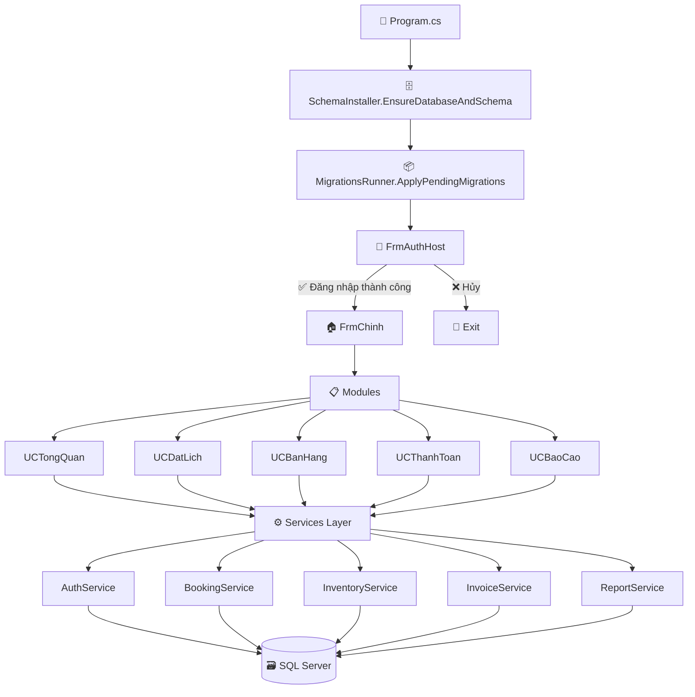

<div align="center">
  
  <h1>🎾 DemoPick</h1>
  <p><b>Nền tảng quản lý sân Pickleball chuyên nghiệp — Vận hành khép kín & Tự động hóa</b></p>
  <p><i>Đặt lịch · Bán hàng (POS) · Thanh toán · Báo cáo — Tất cả trong một ứng dụng duy nhất</i></p>

  [](#)
  [](#)
  [](#)
  [](#)

  <br>

  [](#)
  [](#)
  [](#)
</div>

<br>

---

## 📑 Mục lục

<details>
<summary>Bấm để xem mục lục đầy đủ</summary>

- [🌟 Giới thiệu](#-giới-thiệu)
- [✨ Tính năng chính](#-tính-năng-chính)
- [🏗️ Kiến trúc hệ thống](#️-kiến-trúc-hệ-thống)
- [🚀 Bắt đầu nhanh](#-bắt-đầu-nhanh)
- [🗄️ Database Workflow](#️-database-workflow)
- [📁 Cấu trúc thư mục](#-cấu-trúc-thư-mục)
- [📚 Tài liệu kỹ thuật](#-tài-liệu-kỹ-thuật)
- [🔒 Bảo mật](#-bảo-mật)

</details>

---

## 🌟 Giới thiệu

> *Kiến tạo giải pháp quản lý sân Pickleball toàn diện — từ đặt lịch đến báo cáo doanh thu, chỉ trong một nền tảng duy nhất.*

**DemoPick** được thiết kế chuyên biệt để giải quyết trọn vẹn bài toán vận hành tại các tổ hợp sân Pickleball hiện đại. Xây dựng trên **.NET Framework 4.8 (WinForms)**, ứng dụng tối ưu hóa mọi quy trình cốt lõi và tích hợp sẵn cơ chế **tự khởi tạo Cơ sở dữ liệu + Migrations tự động** — sẵn sàng chạy ngay mà không cần setup thủ công.

### 💡 Điểm nổi bật

| | Giá trị | Mô tả |
|:---:|:---|:---|
| ⚡ | **Zero-config Database** | App tự tạo DB, chạy schema và apply migrations khi khởi động |
| 🔐 | **Bảo mật đa lớp** | Mã hóa mật khẩu, bảo vệ connection string, audit Zero Trust |
| 📐 | **Kiến trúc rõ ràng** | Phân tách Controller → Service → Database, dễ bảo trì & mở rộng |
| 📊 | **Báo cáo trực quan** | Dashboard KPI, biểu đồ xu hướng, xuất hóa đơn RDLC |

---

## ✨ Tính năng chính

<table>
  <tr>
    <th>📦 Nhóm chức năng</th>
    <th>📝 Mô tả</th>
    <th>🧩 Thành phần</th>
  </tr>
  <tr>
    <td>🔐 <b>Xác thực</b></td>
    <td>Đăng nhập · Đăng ký · Đổi mật khẩu · Auto-seed Admin (DEBUG)</td>
    <td><code>FrmAuthHost</code> · <code>UCLogin</code> · <code>UCRegister</code> · <code>AuthService</code></td>
  </tr>
  <tr>
    <td>📅 <b>Đặt lịch</b></td>
    <td>Booking theo sân/khung giờ · Hiển thị lịch trực quan · Chống trùng lịch</td>
    <td><code>UCDatLich</code> · <code>FrmDatSanCoDinh</code> · <code>BookingController</code></td>
  </tr>
  <tr>
    <td>🛠️ <b>Cố định & Bảo trì</b></td>
    <td>Block lịch recurring · Tách biệt khỏi doanh thu/occupancy</td>
    <td><code>FrmDatSanCoDinh</code></td>
  </tr>
  <tr>
    <td>🛒 <b>POS / Bán hàng</b></td>
    <td>Order sản phẩm/dịch vụ · Gắn vào ca sân · Giảm giá linh hoạt</td>
    <td><code>UCBanHang</code> · <code>PosService</code> · <code>InventoryService</code></td>
  </tr>
  <tr>
    <td>💳 <b>Thanh toán</b></td>
    <td>Hóa đơn hợp nhất (tiền sân + sản phẩm) · Tự động trừ tồn kho</td>
    <td><code>UCThanhToan</code> · <code>InvoiceService</code></td>
  </tr>
  <tr>
    <td>📊 <b>Báo cáo</b></td>
    <td>Dashboard KPI · Top sân · Xu hướng · Lọc theo thời gian</td>
    <td><code>UCBaoCao</code> · <code>ReportService</code> · <code>Bill.rdlc</code></td>
  </tr>
</table>

---

## 🏗️ Kiến trúc hệ thống



> **📌 Kiến trúc script-first:** Schema + Seed + Migrations nằm trong thư mục `Database/`. App sẽ đảm bảo DB tồn tại, chạy schema, rồi apply migrations trước khi mở giao diện.

---

## 🚀 Bắt đầu nhanh

### 📋 Yêu cầu môi trường

| Thành phần | Phiên bản |
|:---|:---|
| 🖥️ Hệ điều hành | Windows 10+ |
| 🔧 IDE | Visual Studio 2019+ (hoặc MSBuild) |
| 📦 Framework | .NET Framework 4.8 |
| 🗄️ Database | SQL Server / SQL Server Express |

### 1️⃣ Cấu hình kết nối Database

Sửa connection string `DefaultConnection` trong [App.config](App.config):

```xml
<add name="DefaultConnection"
     connectionString="Server=.\SQLEXPRESS;Database=PickleBallDB;Integrated Security=True;"
     providerName="System.Data.SqlClient" />
```

> **💡 Mẹo:** Có thể override bằng biến môi trường `DEMOPICK_CONNECTION_STRING` để tránh hardcode connection string.

<details>
<summary>🔐 Bảo vệ connectionStrings (opt-in)</summary>

Set `DEMOPICK_PROTECT_CONNECTIONSTRINGS=1` (hoặc appSetting `ProtectConnectionStrings=true`) để app tự động mã hóa section `connectionStrings` trong file `.exe.config` khi khởi chạy.

</details>

### 2️⃣ Restore packages & Build

```bash
# Restore NuGet packages
nuget restore DemoPick.sln

# Build solution
msbuild DemoPick.sln /p:Configuration=Release
```

> Repo sử dụng `packages.config`, restore theo cấu hình [NuGet.Config](NuGet.Config) (mặc định ra thư mục `../packages`).

### 3️⃣ Chạy ứng dụng

App sẽ tự động thực hiện pipeline khởi tạo:

```
1) ✅ Tạo Database (nếu chưa tồn tại)
2) ✅ Chạy schema script (embedded resource)
3) ✅ Apply pending migrations
4) ✅ Mở màn hình đăng nhập → Sẵn sàng sử dụng!
```

<details>
<summary>🛠️ DEBUG-only: Bootstrap tài khoản Admin</summary>

Ở build **DEBUG**, app có thể seed 1 tài khoản `admin` nếu bảng `StaffAccounts` đang rỗng:
- Mật khẩu lấy từ env var `DEMOPICK_BOOTSTRAP_ADMIN_PASSWORD`
- Hoặc tự sinh ngẫu nhiên và hiển thị **1 lần duy nhất** trên console

</details>

---

## 🗄️ Database Workflow

> 📖 Tài liệu chi tiết: [Docs/DB-WORKFLOW.md](Docs/DB-WORKFLOW.md)

| Thành phần | Đường dẫn | Mô tả |
|:---|:---|:---|
| 📄 **Schema** | [Database/PickleBallDB_Complete.sql](Database/PickleBallDB_Complete.sql) | Schema chính, chạy từ embedded resources khi khởi động |
| 📦 **Migrations** | [Database/Migrations/](Database/Migrations) | Quy ước `NNNN__Description.sql` · Có checksum chống drift |
| 🧪 **Seed data** | [Database/TesterData_Seed.sql](Database/TesterData_Seed.sql) | Dữ liệu test cho môi trường dev (placeholder) |

> ⚠️ **Lưu ý:** File `TesterData_Seed.sql` chỉ nên chạy trong môi trường **dev/test**. Không sử dụng cho production.

---

## 📁 Cấu trúc thư mục

```
DemoPick/
│
├── 🎮 Controllers/        # Controller-level orchestration (booking, ...)
├── 🗄️ Database/            # Schema + Seed + Migrations
├── 📚 Docs/                # Tài liệu kỹ thuật, checklist, smoke test
├── 📐 Models/              # Model / DTO
├── 📊 Reports/             # RDLC templates (ReportViewer)
├── 🎨 Resources/           # Assets (icons, images)
├── ⚙️ Services/            # Data access + Business logic
├── 🔧 Tools/               # Script & tiện ích nội bộ
├── 🖥️ Views/               # WinForms + UserControls
│
├── ⚙️ App.config           # Connection string & runtime config
├── 📦 DemoPick.csproj      # Project file (.NET Framework 4.8)
└── 📦 DemoPick.sln         # Solution file
```

---

## 📚 Tài liệu kỹ thuật

| 📑 Tài liệu | 📝 Mô tả |
|:---|:---|
| 🗺️ [Event Wiring Map](Docs/README.md) | Sơ đồ kết nối sự kiện Click/Event trong toàn bộ ứng dụng |
| ✅ [Double-wiring Checklist](Docs/CLICK-WIRING-CHECKLIST.md) | Checklist chống đăng ký trùng sự kiện |
| 🗄️ [Database Workflow](Docs/DB-WORKFLOW.md) | Quy trình vận hành schema, migrations & seed |
| 🧪 [Smoke Test](Docs/SMOKE_TEST.md) | Test Maintenance booking vs doanh thu/occupancy |
| 🔒 [Security Audit](Docs/SECURITY-AUDIT.md) | Báo cáo kiểm toán bảo mật theo mô hình Zero Trust |

---

## 🔒 Bảo mật

Dự án tuân thủ các nguyên tắc bảo mật nghiêm ngặt:

- 🔐 **Mã hóa mật khẩu** — Không lưu plaintext, sử dụng hash an toàn
- 🛡️ **Bảo vệ Connection String** — Hỗ trợ mã hóa section trong config (opt-in)
- 🔑 **Biến môi trường** — Ưu tiên env var thay vì hardcode thông tin nhạy cảm
- 📋 **Audit toàn diện** — Báo cáo Zero Trust tại [Docs/SECURITY-AUDIT.md](Docs/SECURITY-AUDIT.md)

> ⚠️ Một số nội dung trong audit phản ánh trạng thái tại thời điểm viết. Nếu bạn thay đổi logic seed admin/lockout, hãy rà soát lại để đồng bộ tài liệu.

---

<div align="center">

  **🎾 DemoPick** — *Quản lý sân Pickleball chưa bao giờ dễ dàng đến thế*

  <br>

  Made with ❤️ by [ManhTienBonedry](https://github.com/ManhTienBonedry)

</div>
